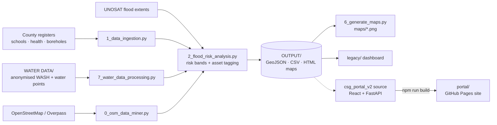

<p align="center">
  <a href="https://jmsmuigai.github.io/Garissa-Early-Warning/"></a>
  
  
  
  <a href="https://www.tovutech.com/projects/gewas/"></a>
  <a href="https://jmsmuigai.github.io/Garissa-Early-Warning/"></a>
</p>

## What it is

**GEWAS (Garissa Early Warning & Adaptation System)** helps Garissa County see which communities and facilities are exposed to flooding ahead of the expected late-2026 El Niño rains. This repository hosts the public website on GitHub Pages and the Python GIS pipeline that produces its map layers.

The website now serves the **Garissa County Steering Group (CSG) portal v2** — a trilingual, map-first early-warning portal — with the earlier GEWAS dashboard kept under `legacy/`. It is intended for county officers, humanitarian partners and residents. Outputs are decision-support scenarios; official KMD, WRA, NDMA and County advisories always take priority.

## What it does

- 🗺️ **Public portal (`portal/`)** – static build of the CSG portal: risk map with flood extents, Tana buffers, laghas, schools, health facilities, boreholes and camps; "Am I at risk?" check; El Niño watch; health & WASH risk; community map composer. Runs fully static on GitHub Pages using JSON model snapshots and live Open-Meteo weather.
- 🧩 **Portal source (`csg_portal_v2/source/csg-portal/`)** – React/Vite frontend and FastAPI backend (optional Gemini assistant, translation, stored reports). Also maintained in [Garissa-County-Steering-Group-Portal](https://github.com/jmsmuigai/Garissa-County-Steering-Group-Portal).
- 🕰️ **Legacy dashboard (`legacy/`)** – the first GEWAS Leaflet dashboard, kept for reference.
- 🌊 **Flood-risk pipeline** – `2_flood_risk_analysis.py` builds concentric risk bands (~500 m / 1.5 km / 3.3 km / 5.5 km) around UNOSAT 2024 flood extents, clipped to the county, and tags schools, health facilities, boreholes, water pans, IDP camps, towns, roads, mosques and points of interest with a risk level and distance to flooding.
- 📍 **OSM mining** – `0_osm_data_miner.py` / `fetch_mosques.py` pull mosques, informal settlements (bullas) and named POIs from the Overpass API.
- 💧 **Water data** – `7_water_data_processing.py` turns the water-point, water-pan and WASH survey files in `WATER DATA/` into GeoJSON layers, filtering points outside Garissa's bounds.
- 🖼️ **Maps & stories** – `6_generate_maps.py` renders the PNG map series in `maps/`; `garissa_elnino_flood_risk.ipynb` is the narrative notebook exported to `garissa_flood_risk_story.html`.
- 🤖 **Optional AI advisory** – `gemini_advisor.py` drafts `OUTPUT/AI_FLOOD_RISK_ADVISORY.md` when `GOOGLE_API_KEY` is set.

## How it works



## Tech stack

| Area | Tools |
|---|---|
| Geoprocessing | Python, GeoPandas, Shapely, pandas, requests (Overpass), Earth Engine / geemap |
| Web portal | React, Vite, TypeScript, Tailwind CSS, Leaflet, Recharts (built into `portal/`) |
| Portal backend (optional) | FastAPI, Uvicorn, Google Gemini |
| Desktop GIS | QGIS / PyQGIS (`3_qgis_workspace_builder.py`) |
| Hosting | GitHub Pages (root `index.html` redirects to `portal/`) |

## Getting started

**View the site:** https://jmsmuigai.github.io/Garissa-Early-Warning/ — or locally:

```bash
git clone https://github.com/jmsmuigai/Garissa-Early-Warning.git
cd Garissa-Early-Warning
python3 -m http.server 8080      # open http://localhost:8080
```

**Run the GIS pipeline:**

```bash
python3 -m venv .venv && source .venv/bin/activate
pip install geopandas shapely pandas requests matplotlib openpyxl
python3 2_flood_risk_analysis.py
python3 7_water_data_processing.py
./run_full_pipeline.sh           # full chain (expects .venv and the raw GIS folders)
```

> ⚠️ Raw shapefiles, GeoPackages and rasters are git-ignored and must be supplied locally. Several helper scripts (e.g. `0_osm_data_miner.py`, `6_generate_maps.py`) still use a hard-coded local `BASE_DIR`; change it before running elsewhere. There is no `requirements.txt` in this repo yet.

**Rebuild the portal:**

```bash
cd csg_portal_v2/source/csg-portal/frontend
npm install && npm run build
# copy frontend/dist/* into ../../../../portal/
```

Optional keys go in a git-ignored `.env` (e.g. `GOOGLE_API_KEY=...` for the advisory script, `GEMINI_API_KEY=...` for the portal backend). The static site needs no keys.

## Data & privacy

- **Sources:** UNOSAT flood extents, county education, health and water registers, OpenStreetMap, 2019 census, Open-Meteo weather and the public datasets cited inside the portal.
- **Personal data removed:** enumerator, facility in-charge and head-teacher names and phone numbers, water-point contact persons, KoboToolbox usernames, device/submission IDs and timestamps were stripped from the WASH and water-point files, and an HR records copy was removed from the repository. Details: [`WATER DATA/README.md`](WATER%20DATA/README.md).
- Raw survey exports containing personal data must never be committed.

## Status & roadmap

**Status:** live demo on GitHub Pages (portal v2); the Python pipeline is a working research prototype with buffer-based risk zones rather than hydraulic flood modelling.

Possible next steps:
- Add `requirements.txt` and remove hard-coded paths from helper scripts.
- Automate portal rebuild and deployment from `csg_portal_v2/source`.
- Validate risk zones against observed 2026 flood extents.
- Retire one-off `patch_*.py` scripts.

## Security

See [SECURITY.md](SECURITY.md). Never commit API keys or personal data.

---

<p align="center">
  <b>Built by James M. Mburu · TovuTech Limited</b><br>
  <a href="https://www.tovutech.com">https://www.tovutech.com</a> · <a href="mailto:intelligence@tovutech.com">intelligence@tovutech.com</a><br>
  📖 Case study: <a href="https://www.tovutech.com/projects/gewas/">tovutech.com/projects/gewas</a>
</p>
